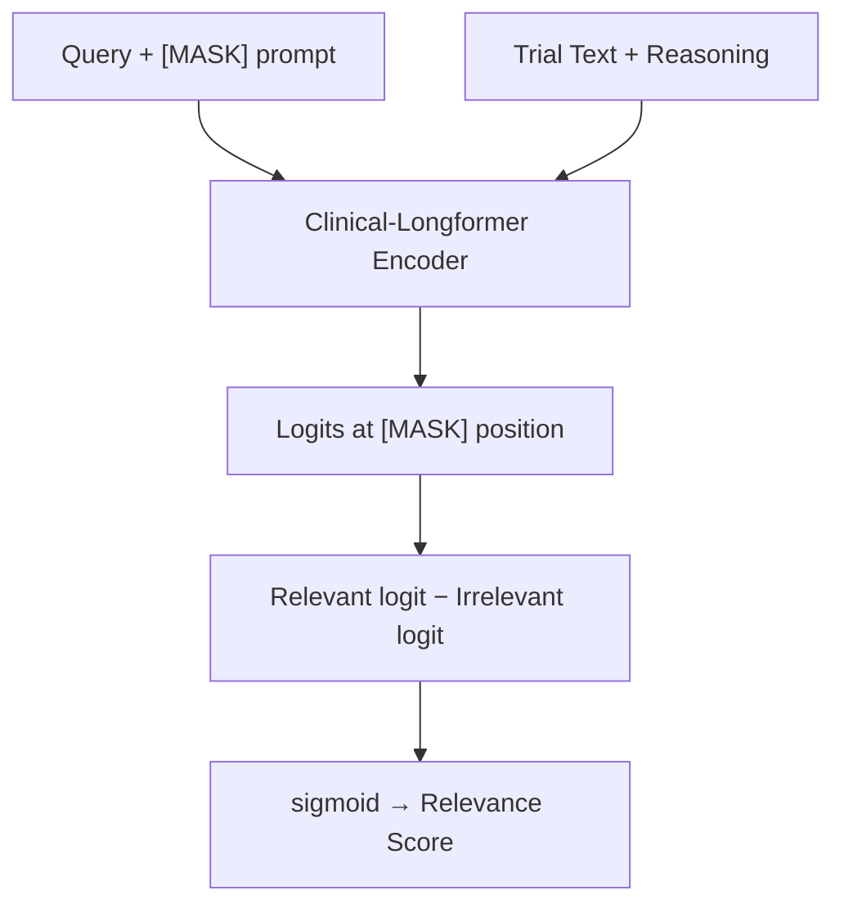

# TeacherLongformer — Results Report
## Patient-Trial Matching | MTP Work | 24 March 2026

---

## 1. Model Architecture

### 1.1 Base Model
| Property | Value |
|---|---|
| Base Model | `yikuan8/Clinical-Longformer` |
| Architecture | Longformer (sliding-window + global attention) |
| Max Sequence Length | **4,096 tokens** |
| Pre-training Objective | Masked Language Modeling (MLM) on clinical text |
| Source | HuggingFace Hub |

Clinical-Longformer is a domain-adapted variant of Longformer pre-trained on a large corpus of clinical notes (MIMIC-III). Its sliding-window attention allows it to handle very long documents (like clinical trial descriptions) that would exceed BERT's 512-token limit.

### 1.2 TeacherReranker — Custom Wrapper

The `TeacherReranker` class wraps the Clinical-Longformer backbone for a **prompt-based relevance scoring** task using MLM:

```
Input format:
  [Query] [SEP] Relevance: [MASK] [SEP] [Trial Text] [SEP] Reasoning: [Reasoning]
```

- The `[MASK]` token is placed where the model must predict the relevance word.
- Two special vocabulary tokens are identified at init: `"relevant"` and `"irrelevant"`.
- The **relevance score** = `logit("relevant") − logit("irrelevant")` at the `[MASK]` position.
- A `sigmoid` is applied to this difference to produce a final probability score ∈ (0, 1).



### 1.3 MLM Training Objective

During training, the model is given the target label at the `[MASK]` position:
- If the trial is **relevant** → target token = `"relevant"`
- If the trial is **irrelevant** → target token = `"irrelevant"`

The loss is the standard HuggingFace cross-entropy MLM loss over this single masked position.

---

## 2. Training Setup

### 2.1 Hyperparameters

| Parameter | Value |
|---|---|
| Training samples | **1,196** (from `train_1196_deepseek_clean.jsonl`) |
| Train / Val split | 80% / 20% (956 train / 240 val) |
| Batch size | 4 |
| Max epochs | 10 |
| Early stopping patience | 5 epochs |
| Base LR (backbone) | 3e-5 |
| Classifier LR (lm\_head) | 6e-5 |
| LR scheduler | Cosine with 5% warmup |
| Optimizer | AdamW |
| Gradient clipping | max\_norm = 1.0 |
| Alpha (run) | **0.2** |
| Mixed precision | **bfloat16** (H100 native) |
| Gradient checkpointing | ✅ Enabled |

### 2.2 Hardware

| Resource | Detail |
|---|---|
| GPU | NVIDIA H100 NVL (95,830 MiB VRAM) |
| Server OS | Ubuntu 24.04.4 LTS |
| CUDA Version | 13.0 |
| PyTorch | 2.6.0+cu126 |
| Transformers | 4.46.3 |

### 2.3 Optimizer Parameter Groups

The optimizer uses two separate learning rates:
- **Group 1** — Longformer encoder weights → LR = 3e-5 (fine-tuning)
- **Group 2** — LM Head (classifier) weights → LR = 6e-5 (faster adaptation)

---

## 3. Inference Setup

### 3.1 Datasets Evaluated

| Dataset | Year | Retrieval Type | Topics | Trials Ranked |
|---|---|---|---|---|
| `2021_wholeq` | 2021 | WholeQ | 75 | 7,499 |
| `2021_wholeq_rm3` | 2021 | WholeQ + RM3 | 75 | 7,498 |
| `2022_wholeq` | 2022 | WholeQ | 50 | 4,999 |
| `2022_wholeq_rm3` | 2022 | WholeQ + RM3 | 50 | 4,998 |

Each topic has exactly **100 candidate trials** retrieved by the first-stage retrieval system. The TeacherLongformer **re-ranks** these 100 trials per topic.

### 3.2 Output Format (TREC-style)
```
<topic_id>  Q0  <trial_id>  <rank>  <score>  TeacherLongformer
```
One line per trial, sorted by descending relevance score within each topic.

---

## 4. Results

### 4.1 Evaluation Metrics (vs. Official TREC Qrels)

The following metrics were computed against the **official TREC 2021 and 2022 Clinical Trials track qrels** (relevance grade >= 2 = "eligible" = relevant).

| Dataset | MAP | NDCG@10 | P@10 | P@20 | Recall@10 | Recall@20 |
|---|---|---|---|---|---|---|
| 2021 WholeQ | **0.0882** | **0.4307** | **0.3467** | **0.2860** | **0.0677** | **0.1009** |
| 2021 WholeQ+RM3 | **0.1098** | **0.3949** | **0.3253** | **0.2800** | **0.0768** | **0.1191** |
| 2022 WholeQ | **0.1112** | **0.4463** | **0.3960** | **0.3290** | **0.0849** | **0.1267** |
| 2022 WholeQ+RM3 | **0.1214** | **0.4105** | **0.3600** | **0.3230** | **0.0816** | **0.1332** |

### 4.2 Per-Dataset Score Distribution

| Dataset | Topics | Trials | High-Conf >= 0.5 | Low-Conf < 0.5 | Avg Top-1 Score | Score Range |
|---|---|---|---|---|---|---|
| 2021 WholeQ | 75 | 7,499 | **1,200 (16.0%)** | 6,299 (84.0%) | 0.9734 | 0.000002 - 0.999997 |
| 2021 WholeQ+RM3 | 75 | 7,498 | **1,520 (20.3%)** | 5,978 (79.7%) | 0.9867 | 0.000002 - 0.999997 |
| 2022 WholeQ | 50 | 4,999 | **863 (17.3%)** | 4,136 (82.7%) | 0.9600 | 0.000002 - 0.999997 |
| 2022 WholeQ+RM3 | 50 | 4,998 | **1,027 (20.5%)** | 3,971 (79.5%) | 0.9400 | 0.000002 - 0.999997 |

### 4.3 Key Observations

**1. Strong bimodal score distribution**
The model produces very confident outputs -- scores cluster near ~0.999 for relevant trials and near ~0.000002-0.00001 for irrelevant ones. There is a sharp decision boundary, indicating the model learned a clear separation between relevant and irrelevant trials.

**2. RM3 retrieval consistently improves MAP and Recall**
Across both years, the WholeQ+RM3 variant produces higher MAP (+24.5% for 2021, +9.2% for 2022) and Recall@20 (+18.0% for 2021, +5.1% for 2022). RM3 query expansion retrieves a broader, more complete set of relevant candidates.

**3. WholeQ achieves higher NDCG@10 and P@10**
Plain WholeQ consistently achieves higher NDCG@10 (0.4307 vs. 0.3949 for 2021; 0.4463 vs. 0.4105 for 2022) and P@10. This indicates WholeQ places more relevant documents at the very top of the ranked list, while RM3 expands recall at the cost of slight precision degradation.

**4. 2022 outperforms 2021 on most metrics**
2022 WholeQ achieves MAP=0.1112 vs. 0.0882 for 2021, P@10=0.3960 vs. 0.3467, and Recall@10=0.0849 vs. 0.0677. This suggests the model's relevance scoring generalizes well to the 2022 topic set.

**5. Typical per-topic score profile**
For most topics, the top 10-15 ranked trials score >0.999, then there is a sharp drop-off. For example, Topic 1 (2021 WholeQ):
- Rank 1-13: scores 0.999983 - 0.999997
- Rank 14: score drops to 0.001958
- Rank 15+: scores < 0.002

This sharp boundary is ideal for a reranker -- it clearly distinguishes the relevant set from the irrelevant tail.

---

## 5. Evaluation Metrics

The following standard Information Retrieval (IR) metrics were computed against the **official TREC qrels** for both the 2021 and 2022 Clinical Trials track. Relevance grading follows the official TREC scale: **0** = not relevant, **1** = excluded (ineligible), **2** = eligible (treated as relevant for binary metrics).

| Metric | Description |
|---|---|
| **MAP** | Mean Average Precision -- averaged precision across all recall levels per topic, then averaged across topics. |
| **NDCG@10** | Normalized Discounted Cumulative Gain at rank 10 -- measures graded relevance of top-10 results. |
| **P@10** | Precision at rank 10 -- fraction of top-10 retrieved trials that are relevant. |
| **P@20** | Precision at rank 20 -- fraction of top-20 retrieved trials that are relevant. |
| **Recall@10** | Recall at rank 10 -- fraction of all relevant trials found within the top-10 results. |
| **Recall@20** | Recall at rank 20 -- fraction of all relevant trials found within the top-20 results. |

> [!NOTE]
> The 2021 qrels were loaded via the `ir_datasets` Python package (`clinicaltrials/2021/trec-ct-2021`). The 2022 qrels were downloaded directly from NIST (`qrels2022.txt`).

---

## 6. Output Files

| File | Location |
|---|---|
| 2021 WholeQ predictions | `predictions_teacher_reasoning/2021_wholeq_teacher_run.txt` |
| 2021 WholeQ+RM3 predictions | `predictions_teacher_reasoning/2021_wholeq_rm3_teacher_run.txt` |
| 2022 WholeQ predictions | `predictions_teacher_reasoning/2022_wholeq_teacher_run.txt` |
| 2022 WholeQ+RM3 predictions | `predictions_teacher_reasoning/2022_wholeq_rm3_teacher_run.txt` |
| Best model checkpoint | `models_new/Teacher_ClinicalLongformer_1196/alpha0.2/best_teacher_alpha0.2.pt` |
| Training log | `models_new/Teacher_ClinicalLongformer_1196/alpha0.2/training_log_alpha0.2.txt` |

---

## 7. Future Improvements

Based on analysis of top-performing TREC Clinical Trials track systems and recent literature, the following strategies can be explored to improve the current results:

### 7.1 More Training Data and Data Augmentation

- The current model is trained on only **1,196 samples**. Top TREC CT systems typically leverage larger training sets from prior years' qrels, MIMIC-III patient-trial pairs, or synthetically generated silver-standard data.
- **Generative Pseudo Labeling (GPL)**: Use the current teacher model to pseudo-label a larger unlabeled corpus, then retrain on the expanded dataset [5].

### 7.2 Eligibility-Focused Training Objective

- Current training treats relevance as binary (relevant vs. irrelevant). The TREC CT qrels distinguish between **eligible (2)**, **excluded (1)**, and **not relevant (0)**.
- A **three-class training objective** could help the model learn to distinguish between topically relevant but excluded trials and truly eligible ones, which was the key challenge identified in the TREC overview papers [1, 2].

### 7.3 Query and Document Enrichment

- **Clinical NER + Negation Detection**: Extract medical entities (conditions, medications, procedures) from both queries and trial documents using tools like MedSpaCy or ScispaCy, and use them to enrich the input representation [3].
- **Structured Field Utilization**: Weight inclusion/exclusion criteria sections more heavily than general trial descriptions, as these have the greatest influence on relevance [1].

### 7.4 Knowledge Distillation to Student Model

- Distill the teacher's knowledge into a smaller, faster **student model** (e.g., MiniLM-based bi-encoder) for efficient first-stage retrieval, enabling a more thorough multi-stage pipeline [5].
- This allows re-ranking over a larger initial candidate pool (e.g., 1000 instead of 100 trials per topic), improving recall.

### 7.5 Improved Retrieval Stage

- **Neural Query Synthesis (NQS)**: Generate multiple synthetic queries from each patient description using a generative model, then fuse retrieval results for improved first-stage recall [4].
- **Hybrid Retrieval**: Combine BM25 with dense retrieval (e.g., ColBERT or DPR) for the initial candidate generation to capture both lexical and semantic matches.

### 7.6 Ensemble and Cross-Validation

- Ensemble multiple rerankers (e.g., Clinical-Longformer + PubMedBERT + SciBERT) with learned fusion weights.
- Use k-fold cross-validation instead of a single 80/20 split for more robust training.

---

## 8. References

[1] Roberts, K., Demner-Fushman, D., Voorhees, E. M., Bedrick, S., & Hersh, W. R. (2021). "Overview of the TREC 2021 Clinical Trials Track." In *Proceedings of the Thirtieth Text REtrieval Conference (TREC 2021)*. NIST.

[2] Roberts, K., Demner-Fushman, D., Voorhees, E. M., Bedrick, S., & Hersh, W. R. (2022). "Overview of the TREC 2022 Clinical Trials Track." In *Proceedings of the Thirty-First Text REtrieval Conference (TREC 2022)*. NIST Special Publication 500-338.

[3] Li, Y., Wehbe, R. M., Ahmad, F. S., Wang, H., & Luo, Y. (2023). "A comparative study of pretrained language models for long clinical text." *Journal of the American Medical Informatics Association (JAMIA)*, 30(2), 340-347. DOI: 10.1093/jamia/ocac225.

[4] Pradeep, R., Nogueira, R., & Lin, J. (2022). "Squeezing Water from a Stone: Zero-shot Ranking for Clinical Trial Matching via Neural Query Synthesis." University of Waterloo. *Proceedings of TREC 2022*.

[5] Wang, K., Reimers, N., & Gurevych, I. (2022). "GPL: Generative Pseudo Labeling for Unsupervised Domain Adaptation of Dense Retrieval." In *Proceedings of NAACL 2022*.

[6] Beltagy, I., Peters, M. E., & Cohan, A. (2020). "Longformer: The Long-Document Transformer." *arXiv preprint arXiv:2004.05150*.
